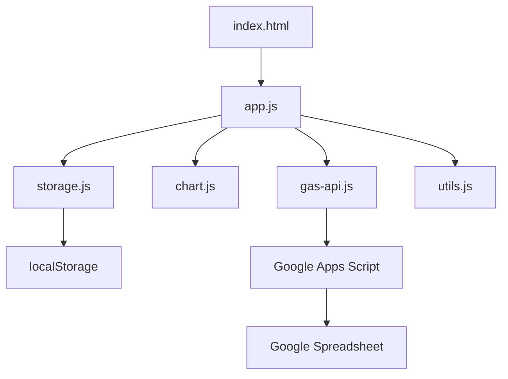

# 💰 支出管理アプリケーション - 詳細仕様書

> **プロジェクト名**: Expense Tracker Pro  
> **バージョン**: 1.0.0  
> **最終更新**: 2026-01-02

---

## 📋 目次

1. [プロジェクト概要](#プロジェクト概要)
2. [技術スタック](#技術スタック)
3. [機能要件](#機能要件)
4. [データ構造](#データ構造)
5. [UI/UX設計](#uiux設計)
6. [アーキテクチャ](#アーキテクチャ)
7. [セキュリティ要件](#セキュリティ要件)
8. [パフォーマンス要件](#パフォーマンス要件)
9. [デプロイメント](#デプロイメント)

---

## 🎯 プロジェクト概要

### コンセプト
モダンで直感的なUIを持つ、個人向け支出管理アプリケーション。データはlocalStorageとGoogle Spreadsheetの二重保存で安全性を確保し、リアルタイムな可視化で支出傾向を把握できます。

### ターゲットユーザー
- 個人の家計管理をしたい方
- 支出の可視化・分析をしたい方
- シンプルで使いやすいツールを求める方

### 主要な特徴
- 📊 **リアルタイム可視化**: Chart.jsによる美しいグラフ表示
- 💾 **二重保存**: localStorage + Google Spreadsheet
- 🌙 **ダークモード**: 目に優しいデザイン
- 📱 **レスポンシブ**: モバイルファースト設計
- 🎨 **モダンUI**: Bootstrap 5による洗練されたデザイン

---

## 🛠 技術スタック

### フロントエンド

| 技術 | 用途 | バージョン |
|------|------|-----------|
| HTML5 | マークアップ | - |
| CSS3 | スタイリング | - |
| JavaScript (ES6+) | アプリケーションロジック | - |
| Bootstrap 5 | UIフレームワーク | 5.3.x |
| Chart.js | グラフ描画 | 4.x |
| Font Awesome | アイコン | 6.x |

### バックエンド

| 技術 | 用途 |
|------|------|
| Google Apps Script | サーバーレスバックエンド |
| Google Spreadsheet API | データバックアップ |

### 開発ツール

| ツール | 用途 |
|--------|------|
| Git | バージョン管理 |
| GitHub | コードホスティング |
| GitHub Pages | デプロイメント |

---

## ✅ 機能要件

### 1. 支出記録機能

#### 入力フォーム要素

| 項目 | タイプ | 必須 | 説明 |
|------|--------|------|------|
| 日付 | Date | ✓ | デフォルト: 今日の日付 |
| カテゴリ | Select | ✓ | ドロップダウン選択 |
| 金額 | Number | ✓ | 数値のみ、カンマ区切り表示 |
| メモ | Text | - | 任意、最大200文字 |

#### 機能詳細
- ✅ リアルタイムバリデーション
- ✅ 入力後の即座な一覧反映
- ✅ 「登録」ボタン押下でlocalStorageに保存
- ✅ 成功時のトースト通知
- ✅ エラー時のエラーメッセージ表示

#### バリデーションルール
```javascript
{
  date: "必須、過去または今日の日付",
  category: "必須、定義済みカテゴリから選択",
  amount: "必須、0より大きい数値",
  memo: "任意、最大200文字"
}
```

---

### 2. 支出一覧表示

#### レイアウトオプション
- **カード型**: デフォルト（モバイルフレンドリー）
- **テーブル型**: デスクトップ向け詳細表示

#### 表示機能
- ✅ 日付の新しい順にソート
- ✅ 各項目に編集・削除ボタン
- ✅ 削除時は確認ダイアログ表示
- ✅ ページネーション（20件/ページ）
- ✅ 無限スクロール対応

#### フィルター機能

| フィルタータイプ | 説明 |
|-----------------|------|
| 日付範囲 | 開始日〜終了日で絞り込み |
| カテゴリ | 複数選択可能 |
| 金額範囲 | 最小〜最大金額 |

#### 検索機能
- メモ内容での全文検索
- リアルタイム検索（デバウンス300ms）

---

### 3. カテゴリ別集計・可視化

#### 対応カテゴリ

| カテゴリ | アイコン | カラー |
|---------|---------|--------|
| 食費 | 🍽️ | #F59E0B (オレンジ) |
| 交通費 | 🚃 | #3B82F6 (青) |
| 娯楽費 | 🎮 | #EF4444 (赤) |
| 光熱費 | 💡 | #FBBF24 (黄) |
| 通信費 | 📱 | #8B5CF6 (紫) |
| 医療費 | 🏥 | #10B981 (緑) |
| その他 | 📦 | #6B7280 (グレー) |

#### グラフ表示

**円グラフ/ドーナツチャート**
- カテゴリ別比率を視覚化
- ホバーで金額と割合を表示
- クリックで該当カテゴリの詳細表示

**棒グラフ**
- カテゴリ別金額比較
- 横軸: カテゴリ
- 縦軸: 金額（円）

#### 集計期間
- ✅ 今週
- ✅ 今月（デフォルト）
- ✅ 先月
- ✅ カスタム期間

---

### 4. ダッシュボード

#### 表示要素

```
┌─────────────────────────────────────┐
│  今月の総支出額                        │
│  ¥123,456                           │
│  前月比: +12.3% ↑                    │
└─────────────────────────────────────┘

┌─────────────────────────────────────┐
│  TOP3 カテゴリ                        │
│  1. 食費: ¥45,000 (36.5%)          │
│  2. 交通費: ¥23,000 (18.6%)        │
│  3. 娯楽費: ¥18,000 (14.6%)        │
└─────────────────────────────────────┘

┌─────────────────────────────────────┐
│  最近の支出履歴（直近5件）              │
│  ・2026-01-02 食費 ¥800 ランチ     │
│  ・2026-01-01 交通費 ¥300 電車     │
│  ...                                │
└─────────────────────────────────────┘
```

---

### 5. 予算管理

#### 機能
- ✅ 月間予算設定
- ✅ 予算に対する使用率（プログレスバー）
- ✅ 予算超過時のアラート（80%, 100%, 120%）
- ✅ カテゴリ別予算設定（オプション）

#### データ構造
```javascript
{
  monthlyBudget: 100000,
  categoryBudgets: {
    "食費": 30000,
    "交通費": 15000,
    // ...
  }
}
```

---

### 6. データ管理

#### エクスポート機能
- **CSV形式**: Excel互換
- **JSON形式**: データバックアップ
- ダウンロードファイル名: `expenses_YYYYMMDD.csv`

#### インポート機能
- CSV/JSONファイルからインポート
- データバリデーション
- 重複チェック

#### Google Spreadsheet同期
- ✅ 手動同期ボタン
- ✅ 自動同期（5分ごと、オプション）
- ✅ 同期ステータス表示
- ✅ 衝突解決ロジック

#### データ削除
- 全データ削除（確認ダイアログ × 2回）
- 期間指定削除
- カテゴリ指定削除

---

## 📊 データ構造

### localStorage スキーマ

#### expenses（支出データ）
```javascript
[
  {
    id: "1704196800000",           // タイムスタンプ（ユニークID）
    date: "2026-01-02",             // 日付 (YYYY-MM-DD)
    category: "食費",                // カテゴリ
    amount: 800,                    // 金額
    memo: "ランチ",                  // メモ
    createdAt: "2026-01-02T12:00:00Z", // 作成日時
    updatedAt: "2026-01-02T12:00:00Z"  // 更新日時
  }
]
```

#### settings（設定データ）
```javascript
{
  darkMode: true,                 // ダークモード
  monthlyBudget: 100000,          // 月間予算
  categoryBudgets: {},            // カテゴリ別予算
  autoSync: false,                // 自動同期
  syncInterval: 300000,           // 同期間隔（ms）
  currency: "JPY",                // 通貨
  dateFormat: "YYYY-MM-DD"        // 日付フォーマット
}
```

#### syncConfig（同期設定）
```javascript
{
  spreadsheetId: "...",           // SpreadsheetID
  sheetName: "Expenses",          // シート名
  lastSyncTime: "2026-01-02T12:00:00Z", // 最終同期時刻
  syncEnabled: true               // 同期有効化
}
```

---

## 🎨 UI/UX設計

### デザインコンセプト
- **モダン**: 最新のデザイントレンド
- **ミニマル**: シンプルで分かりやすい
- **プレミアム**: 高級感のある見た目
- **レスポンシブ**: あらゆるデバイスに対応

### カラースキーム

#### ライトモード
```css
--primary: #4F46E5;      /* 藍色 */
--secondary: #10B981;    /* 緑 */
--danger: #EF4444;       /* 赤 */
--warning: #F59E0B;      /* オレンジ */
--info: #3B82F6;         /* 青 */
--background: #F9FAFB;   /* 背景 */
--surface: #FFFFFF;      /* カード背景 */
--text: #111827;         /* テキスト */
```

#### ダークモード
```css
--primary: #6366F1;
--secondary: #34D399;
--danger: #F87171;
--warning: #FBBF24;
--info: #60A5FA;
--background: #1F2937;
--surface: #374151;
--text: #F9FAFB;
```

### レイアウト構造

```
┌────────────────────────────────────────┐
│  Header: ロゴ | ナビ | ダークモード切替  │
├─────────┬──────────────────────────────┤
│ Sidebar │  Main Content                 │
│         │                               │
│ ・ダッシュ │  ┌─────────────────────┐    │
│ ・記録   │  │  ページコンテンツ      │    │
│ ・一覧   │  │                     │    │
│ ・集計   │  └─────────────────────┘    │
│ ・設定   │                               │
└─────────┴──────────────────────────────┘
```

#### モバイルレイアウト
```
┌────────────────────┐
│  Header + 🍔メニュー │
├────────────────────┤
│                    │
│  Main Content      │
│                    │
├────────────────────┤
│  Bottom Nav        │
└────────────────────┘
```

### タイポグラフィ
- **見出し**: 'Outfit', sans-serif
- **本文**: 'Inter', sans-serif
- **数値**: 'Roboto Mono', monospace

---

## 🏗 アーキテクチャ

### ファイル構成

```
expense-tracker/
├── index.html                    # エントリーポイント
├── css/
│   ├── style.css                # メインスタイル
│   └── dark-mode.css            # ダークモードスタイル
├── js/
│   ├── app.js                   # メインアプリケーション
│   ├── storage.js               # localStorage管理
│   ├── chart.js                 # グラフ描画
│   ├── gas-api.js               # GAS連携
│   ├── utils.js                 # ユーティリティ
│   └── config.js                # 設定
├── assets/
│   ├── icons/                   # アイコン画像
│   └── images/                  # 画像
├── gas/
│   └── Code.gs                  # Google Apps Script
├── spec.md                      # 本仕様書
├── prompts.txt                  # AI対話記録
├── README.md                    # プロジェクト説明
└── .gitignore                   # Git除外設定
```

### モジュール構成



### JavaScript モジュール設計

#### app.js（メインコントローラー）
```javascript
class ExpenseApp {
  constructor() {
    this.storage = new StorageManager();
    this.chart = new ChartManager();
    this.gasAPI = new GASAPIClient();
    this.init();
  }
  
  init() { /* 初期化 */ }
  addExpense() { /* 支出追加 */ }
  deleteExpense() { /* 支出削除 */ }
  updateExpense() { /* 支出更新 */ }
  // ...
}
```

#### storage.js（ストレージ管理）
```javascript
class StorageManager {
  loadExpenses() { /* 読み込み */ }
  saveExpenses(data) { /* 保存 */ }
  loadSettings() { /* 設定読み込み */ }
  saveSettings(data) { /* 設定保存 */ }
  clearAll() { /* 全削除 */ }
}
```

#### chart.js（グラフ管理）
```javascript
class ChartManager {
  createPieChart(data) { /* 円グラフ */ }
  createBarChart(data) { /* 棒グラフ */ }
  updateChart(chartId, data) { /* 更新 */ }
  destroyChart(chartId) { /* 破棄 */ }
}
```

#### gas-api.js（GAS API クライアント）
```javascript
class GASAPIClient {
  syncToSpreadsheet(data) { /* 同期 */ }
  fetchFromSpreadsheet() { /* 取得 */ }
  testConnection() { /* 接続テスト */ }
}
```

#### utils.js（ユーティリティ）
```javascript
const Utils = {
  formatCurrency(amount) { /* 通貨フォーマット */ },
  formatDate(date) { /* 日付フォーマット */ },
  sanitizeInput(input) { /* サニタイズ */ },
  debounce(func, delay) { /* デバウンス */ },
  showToast(message) { /* トースト通知 */ }
};
```

---

## 🔒 セキュリティ要件

### XSS対策
- ユーザー入力の全サニタイズ
- DOM操作時のエスケープ処理
- Content Security Policy (CSP) 設定

### CSRF対策
- GAS Web App でのトークン検証
- Origin チェック

### データ保護
- 環境変数でAPI鍵管理
- .env ファイル（Gitには含めない）
- Spreadsheet ID の暗号化保存

### 認証
- Google OAuth 2.0（GAS連携時）
- アクセストークンの適切な管理

---

## ⚡ パフォーマンス要件

### 目標指標

| 指標 | 目標値 |
|------|--------|
| ページロード時間 | < 3秒 |
| Time to Interactive (TTI) | < 2秒 |
| First Contentful Paint (FCP) | < 1秒 |
| 操作レスポンス | < 100ms |

### 最適化手法

#### フロントエンド
- ✅ 画像の最適化（WebP形式）
- ✅ 遅延ローディング
- ✅ CSS/JSの圧縮
- ✅ キャッシュ活用

#### JavaScript
- ✅ デバウンス処理（検索: 300ms）
- ✅ スロットル処理（スクロール: 100ms）
- ✅ 仮想スクロール（大量データ）

#### ネットワーク
- ✅ CDN利用（Bootstrap, Chart.js）
- ✅ リソースのプリロード
- ✅ HTTP/2対応

---

## 🚀 デプロイメント

### GitHub Pages設定手順

1. **リポジトリ作成**
```bash
git init
git add .
git commit -m "Initial commit"
git remote add origin https://github.com/[username]/expense-tracker.git
git push -u origin main
```

2. **GitHub Pages有効化**
   - Settings > Pages
   - Source: main branch / root
   - Save

3. **公開URL**
   - `https://[username].github.io/expense-tracker/`

### Google Apps Script デプロイ手順

1. **GASプロジェクト作成**
   - Google Drive > 新規 > Google Apps Script
   - プロジェクト名: "Expense Tracker Backend"

2. **コード配置**
   - `gas/Code.gs` の内容をコピー

3. **デプロイ**
   - デプロイ > 新しいデプロイ
   - 種類: ウェブアプリ
   - アクセス権: 自分のみ
   - デプロイ実行

4. **Web App URL取得**
   - デプロイ後のURLをコピー
   - `js/config.js` に設定

### 環境変数設定

```javascript
// js/config.js
const CONFIG = {
  GAS_WEB_APP_URL: 'YOUR_GAS_WEB_APP_URL',
  SPREADSHEET_ID: 'YOUR_SPREADSHEET_ID',
  VERSION: '1.0.0'
};
```

---

## 📝 追加仕様

### ブラウザ互換性
- Chrome: 最新版
- Firefox: 最新版
- Safari: 最新版
- Edge: 最新版

### アクセシビリティ
- WCAG 2.1 Level AA準拠
- キーボードナビゲーション対応
- スクリーンリーダー対応
- フォーカス管理

### 国際化（将来対応）
- i18n対応の設計
- 日本語/英語切り替え
- 通貨フォーマット

---

## 🔄 バージョニング

- v1.0.0: 初回リリース（本仕様）
- v1.1.0: Google Spreadsheet完全連携
- v1.2.0: データ分析機能追加
- v2.0.0: PWA化、オフライン対応

---

## 📚 参考資料

- [Bootstrap 5 Documentation](https://getbootstrap.com/)
- [Chart.js Documentation](https://www.chartjs.org/)
- [Google Apps Script Reference](https://developers.google.com/apps-script)
- [localStorage API](https://developer.mozilla.org/en-US/docs/Web/API/Window/localStorage)

---

**仕様書バージョン**: 1.0.0  
**作成日**: 2026-01-02  
**承認者**: -
